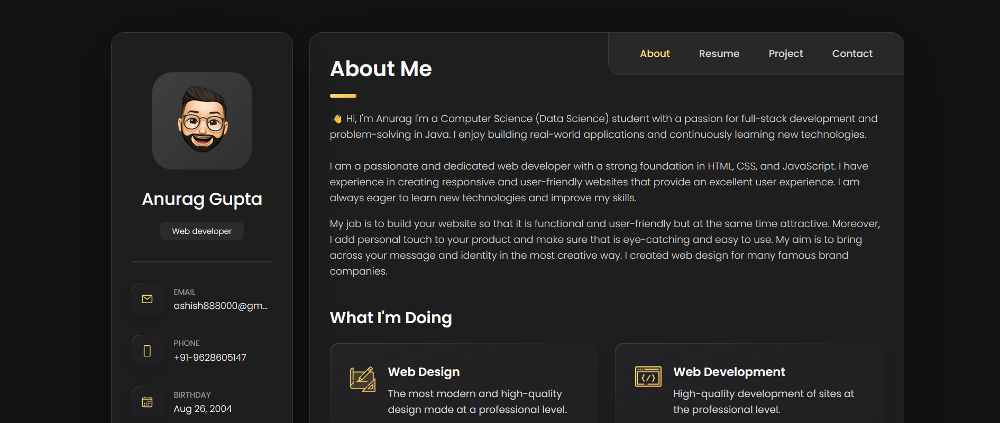

# 🌐 Personal Portfolio Website

A clean and responsive personal portfolio website built using **HTML**, **CSS**, and **JavaScript**. This project showcases my skills, projects, and contact information in a sleek, modern design that looks great on all devices.

## 🚀 Features

- 🖥️ Fully responsive layout (desktop, tablet, mobile)
- ✨ Smooth scrolling and basic animations
- 📁 Projects section with links
- 📬 Contact form
- 📷 Demo image included

## 📸 Demo

 


## 🛠️ Built With

- HTML5
- CSS3 (Flexbox, Grid, Media Queries)
- JavaScript 

## 🌍 Live Preview

[🔗 View Live Demo](https://anurag0.netlify.app/)

## 📦 How to Use

1. Clone the repository:
   ```bash
   git clone https://github.com/Anurag888000/My-Portfolio.git
   cd My-Portfolio
   open index.html
